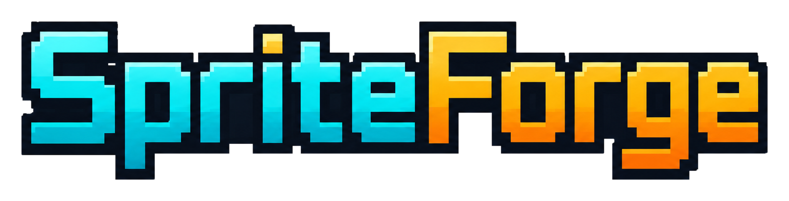

<p align="center">
  
</p>

# SpriteForge

SpriteForge is an experimental, free pixel-art asset generator for 2D games.

The goal is to let people write an idea and generate useful game assets such as:

- PNG frames
- spritesheets
- animated GIF previews
- metadata JSON
- future Godot/Unity export packs

## Current status

SpriteForge is still an early prototype.

It already has:

- Python asset generation
- a local Studio interface
- procedural pixel-art experiments
- prompt-based generation
- exported frames, spritesheets and GIF previews

The quality is not final yet. The next major direction is to build a universal drawing engine.

## Next major step

### SpriteForge v0.9 — Prompt to PixelScript Engine

The next architecture should be:

```text
Prompt
→ Visual Plan
→ PixelScript
→ Renderer
→ Game-ready asset
